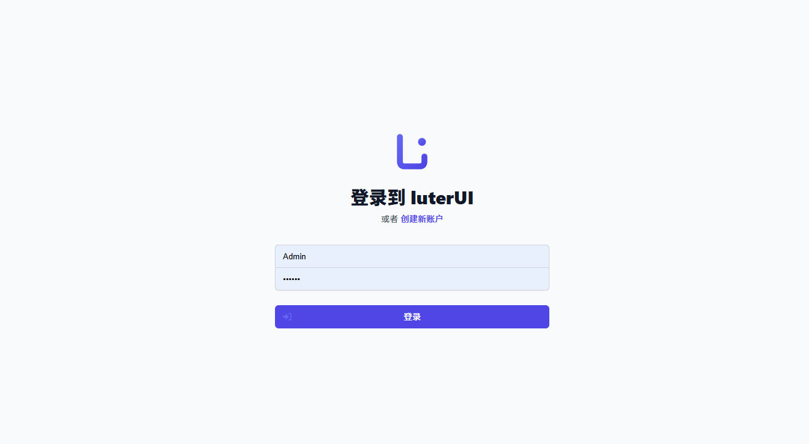
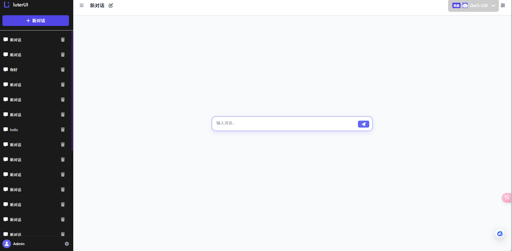
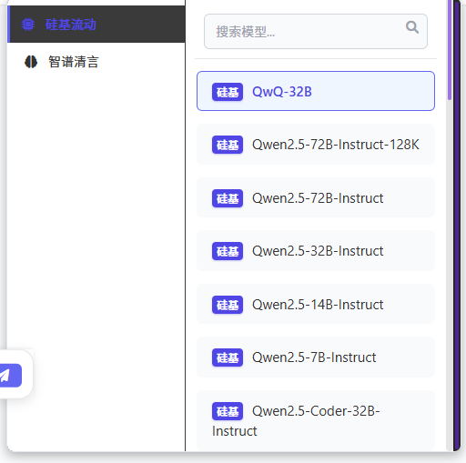
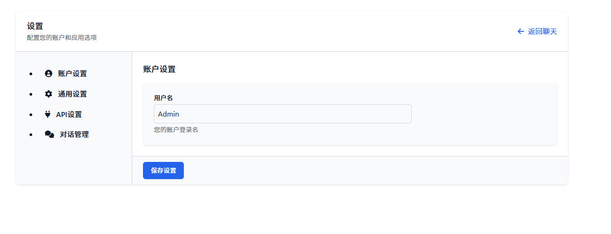
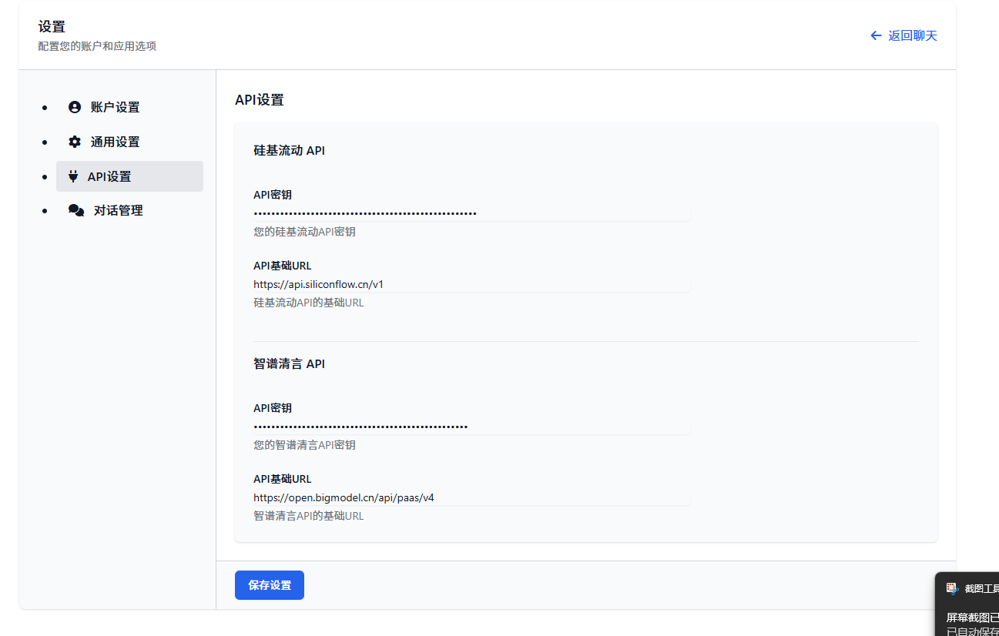

# LuterChatUI

一个现代化的AI对话界面，支持多种模型接入和主题切换的Web应用


## ✨ 特性

- 🎨 **多种主题支持** - 彩色模式、明亮模式、黑暗模式、明亮微观和黑暗微观，满足不同使用场景
- 🤖 **多模型支持** - 集成硅基流动和智谱清言等多种AI大模型接口
- 🔐 **用户系统** - 完善的登录、注册及用户管理功能
- 💬 **对话管理** - 支持创建、保存和管理多个对话
- ⚙️ **API配置** - 灵活的API设置，支持自定义接入不同服务商
- 📱 **响应式设计** - 完美适配桌面端和移动端设备

## 🖼️ 界面展示

### 登录界面



### 聊天界面



### 模型选择



### 设置界面





## 🚀 快速开始

### 安装

```bash
git clone https://github.com/Zhang142857/LuterChatUI.git
cd LuterChatUI
pip install -r requirements.txt
```

### 运行

```bash
python app.py
```

访问 `http://localhost:5000` 即可使用

## 🛠️ 技术栈

- **后端**: Flask, SQLAlchemy, Flask-Login
- **前端**: TailwindCSS, JavaScript
- **AI接口**: 支持硅基流动API和智谱清言API

## 💡 贡献指南

欢迎贡献代码或提交问题！请先fork本项目，然后创建Pull Request。

## 📄 许可证

MIT 许可证

---

📢 **欢迎关注和使用LuterChatUI，享受更轻松、更美观的AI对话体验！**
